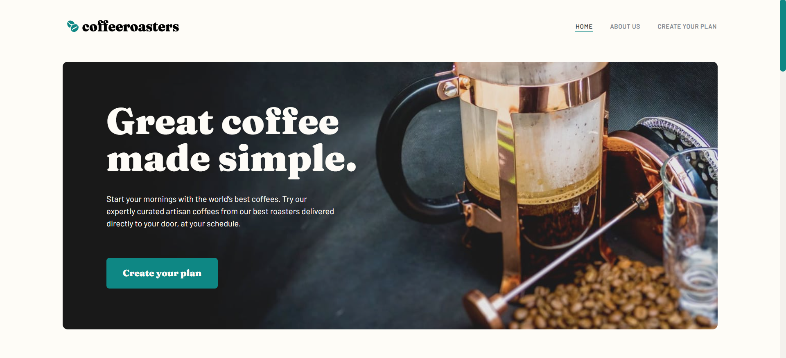
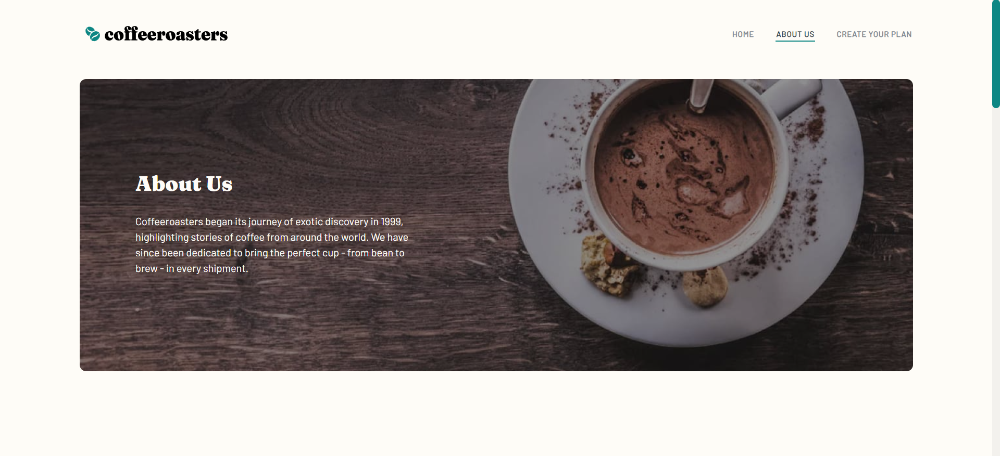
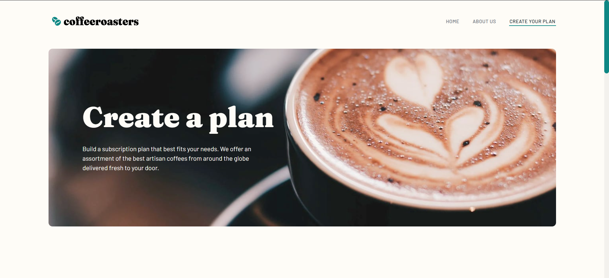
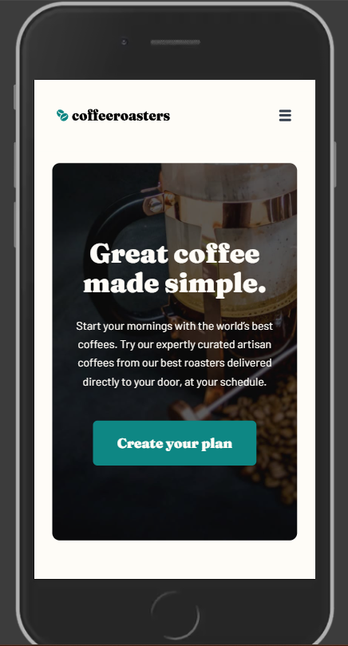
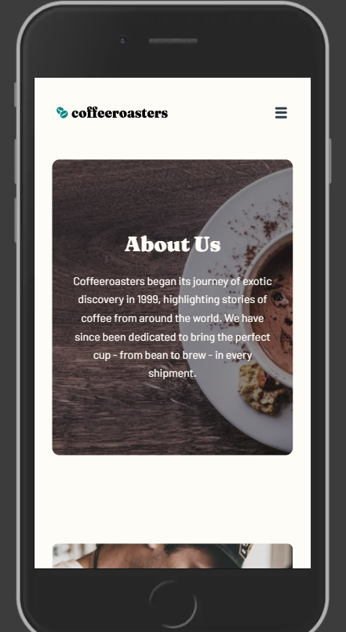
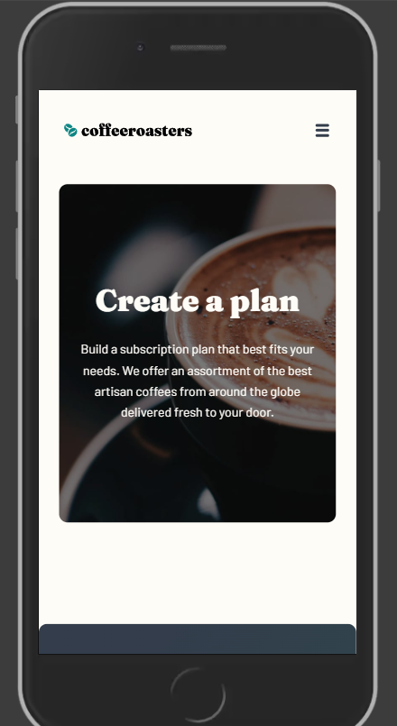

# Frontend Mentor - Coffeeroasters subscription site solution

This is a solution to the [Coffeeroasters subscription site challenge on Frontend Mentor](https://www.frontendmentor.io/challenges/coffeeroasters-subscription-site-5Fc26HVY6). Frontend Mentor challenges help you improve your coding skills by building realistic projects. 

## Table of contents

- [Overview](#overview)
  - [The challenge](#the-challenge)
  - [Screenshot](#screenshot)
  - [Links](#links)
- [My process](#my-process)
  - [Built with](#built-with)
  - [What I learned](#what-i-learned)
  - [Useful resources](#useful-resources)
- [Author](#author)

## Overview

### The challenge

Users should be able to:

- View the optimal layout for each page depending on their device's screen size
- See hover states for all interactive elements throughout the site
- Make selections to create a coffee subscription and see an order summary modal of their choices

### Screenshot

### Links

- Solution URL: [Solution](https://www.frontendmentor.io/challenges/coffeeroasters-subscription-site-5Fc26HVY6/hub)
- Live Site URL: [Live - Vercel](https://fm-coffeeroasters-subscription-site.vercel.app/)

## My process

### Built with

- Semantic HTML5 markup
- Mobile-first workflow
- [React](https://reactjs.org/) - JS library
- [Next.js](https://nextjs.org/) - React framework
- [tailwindCSS](https://tailwindcss.com/) - For styles

### What I learned

I've definitely improved my next.js skills

### Useful resources

- [Next.js docs](https://nextjs.org/docs)
- [tailwindCSS docs](https://tailwindcss.com/docs/)

## Author

- Frontend Mentor - [@Loniewski02](https://www.frontendmentor.io/profile/Loniewski02)
